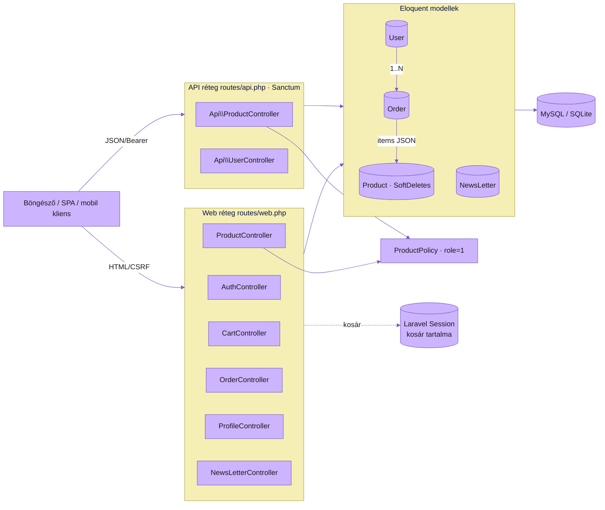
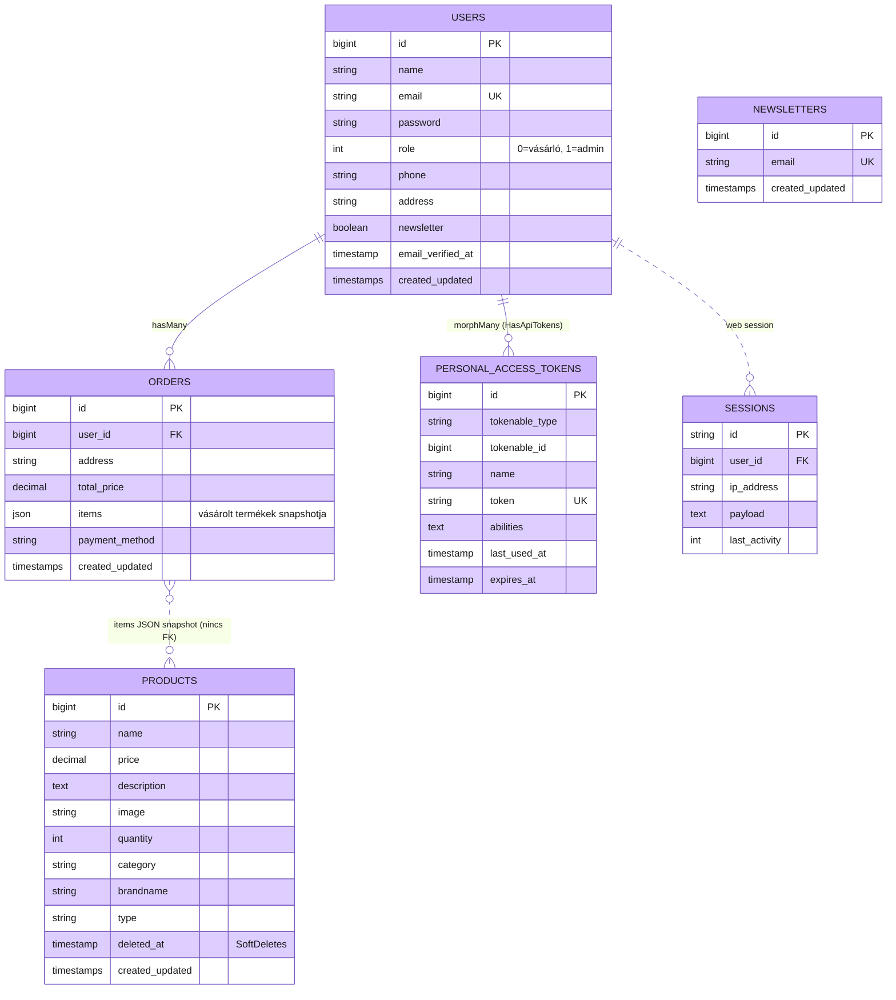

# TechShop – Műszaki Dokumentáció

> Verzió: 1.1 · Dátum: 2026.04.24. · Nyelv: magyar
>
> Készítők: **Harkó Dávid**, **Zakar Levente Gusztáv**, **Iancu-Tóth Daniel**
>
> Rövid, projekt-szintű ismertető és gyors-start: lásd [README.md](README.md). Jelen dokumentum a teljes műszaki dokumentáció.

---

## Tartalomjegyzék

1. [A szoftver célja](#1-a-szoftver-célja)
2. [Architektúra áttekintés](#2-architektúra-áttekintés)
3. [Technikai komponensek](#3-technikai-komponensek)
4. [Működési feltételek](#4-működési-feltételek)
5. [Telepítési és használati útmutató](#5-telepítési-és-használati-útmutató)
6. [Backend működés frontend fejlesztőknek](#6-backend-működés-frontend-fejlesztőknek)
7. [Tesztelés és tesztelési eredmények](#7-tesztelés-és-tesztelési-eredmények)
8. [Biztonság](#8-biztonság)
9. [Karbantartás és bővítés](#9-karbantartás-és-bővítés)
10. [Hibaelhárítás](#10-hibaelhárítás)
11. [Mellékletek – fájlhivatkozások](#11-mellékletek--fájlhivatkozások)
12. [Csapaton belüli munkamegosztás](#12-csapaton-belüli-munkamegosztás)
13. [English abstract](#13-english-abstract)

---

## 1. A szoftver célja

A **TechShop** egy magyar nyelvű, Laravel 12 alapú elektronikai webáruház. Célja, hogy egy könnyen kezelhető, modern felületen keresztül lehetővé tegye:

- **Vásárlók** (regisztrált és vendég) számára:
  - termékek böngészését kategória, típus és ár szerint,
  - kosárkezelést (mennyiség, készletellenőrzés),
  - rendelés leadását szállítási címmel és fizetési móddal,
  - profil kezelését és hírlevél preferencia beállítását,
  - korábbi rendelések megtekintését.
- **Adminisztrátorok** (`role=1`) számára:
  - termékek létrehozását, szerkesztését, "soft delete" alapú törlését és visszaállítását,
  - képfeltöltést a termékekhez.
- **Külső kliensek** (mobil/3rd-party) számára:
  - REST JSON API a termékekre, rendelésekre és felhasználói műveletekre, **Sanctum** Bearer-token alapú hitelesítéssel.
- **Asztali admin kliens** (`APIWinform`):
  - **C# / .NET 10 Windows Forms** alkalmazás, amely a REST API-n keresztül kezeli a termékeket (listázás, szűrés, létrehozás képpel, bulk import .txt-ből, soft delete, visszaállítás, végleges törlés).

A szoftver tipikus felhasználási területe: kis- és középméretű elektronikai webshop demonstrációs vagy oktatási célra, illetve alapváz éles üzem előtti továbbfejlesztéshez.

### 1.1. Motiváció

A projekt az alábbi problémákra reagál, amelyek a hagyományos kis-webshopoknál gyakran felmerülnek:

- **Mobilbarát felület hiánya** – sok kisebb webshop nem reszponzív, ami rontja a felhasználói élményt mobil eszközön.
- **Átláthatatlan navigáció** – modern, kártyás elrendezésű terméklista és szűrők hiánya.
- **Lassú, töredékes vásárlási folyamat** – a TechShop ezzel szemben széles lefedettségű szűrőket (kategória, típus, ártartomány), egy-oldalas auth-felváltást (login ↔ register), session-alapú kosárkezelést és gördülékeny rendelési workflow-t kínál.
- **Fejleszthetőség és biztonság** – modern Laravel-keretrendszerre építve bővíthető alapvázat ad oktatási és prod-pre demonstrációs célra.

### 1.2. Üzleti / oktatási célkitűzések

1. **Hatékony vásárlási folyamat** – minimális hibalehetőség, készletellenőrzés minden lépésnél.
2. **Átlátható struktúra** – reszponzív, kártyás UI desktop / tablet / mobil eszközön egyaránt.
3. **Biztonság és adatvédelem** – bcrypt jelszó, CSRF, Sanctum, role-alapú policy (lásd 8. fejezet).
4. **Felhasználóbarát élmény** – animált input mezők, sötét mód, AJAX hírlevél.

---

## 2. Architektúra áttekintés

A rendszer klasszikus **MVC** (Model–View–Controller) Laravel architektúrára épül, kiegészítve:

- **Form Request** osztályokkal a validáció és authorizáció szétválasztására,
- **Policy**-vel (`ProductPolicy`) a szerep-alapú jogosultságkezelésre (admin / vásárló),
- **Soft delete**-tel a termékek visszavonható törléséhez,
- **Session-alapú kosár**ral (nem perzisztens, böngésző-szintű állapot),
- **Sanctum** API tokenekkel a `routes/api.php` alatti végpontokhoz.

### 2.1. Komponens-kapcsolati ábra



> **Multi-platform megjegyzés (KKK 8.4.2):** A vásárlói kliens egységesen reszponzív web-frontend (Blade + Tailwind 4), amely asztali böngészőkben és mobil eszközön is natív-szerű felhasználói élményt nyújt. Az **adminisztrációs felület** pedig egy külön **natív asztali alkalmazás** (`APIWinform`, C# / .NET 10 Windows Forms), amely a REST API-n keresztül kommunikál a backenddel. Ez pontosan megfelel a KKK példának: *„A felhasználóknak szánt interfész webes megjelenítést használ, míg az adminisztrációs felület natív asztali alkalmazásként készül el"*. Részleteket lásd a [3.10. Asztali admin kliens](#310-asztali-admin-kliens-apiwinform) fejezetben.

### 2.2. Adatfolyam példa: vásárlás

1. Vendég/bejelentkezett felhasználó terméket tesz a kosárba → `POST /cart/add/{product}` → [`CartController::addToCart`](app/Http/Controllers/CartController.php) készletellenőrzés után a session `cart` kulcsába írja a tételt.
2. Bejelentkezett felhasználó leadja a rendelést → `POST /order` → [`OrderController::store`](app/Http/Controllers/OrderController.php) validál, készletet ellenőriz, létrehoz egy `orders` rekordot (items JSON-ben), csökkenti a termékek `quantity` mezőjét, törli a session kosarat.
3. A felhasználó az `orders.index` oldalon visszanézheti a leadott rendeléseket.

---

## 3. Technikai komponensek

### 3.1. Tech stack

| Réteg | Technológia | Verzió |
|---|---|---|
| Nyelv | PHP | ^8.2 |
| Keretrendszer | Laravel | ^12.0 |
| API auth | Laravel Sanctum | ^4.0 |
| Frontend build | Vite | ^7.3 |
| CSS | Tailwind CSS | ^4.0 |
| Adatbázis (prod) | MySQL | 8.x (vagy SQLite) |
| Adatbázis (test) | SQLite (in-memory) | – |
| Tesztelés | PHPUnit | ^11.5 |
| Formázó | Laravel Pint | ^1.24 |
| Asztali admin kliens | C# / .NET Windows Forms | net10.0-windows |
| Admin kliens JSON | Newtonsoft.Json | ^13.0.4 |
| Egyéb | Tinker, Sail, Pail, Faker, Mockery, Collision | (lásd [composer.json](composer.json)) |

### 3.2. Mappa-struktúra (kivonat)

```
app/
  Http/Controllers/      Web és API vezérlők
  Http/Requests/         Form Request validációk
  Models/                Eloquent modellek
  Policies/              Jogosultsági szabályok
  Providers/             Service providerek
database/
  migrations/            Sémamigrációk
  factories/             Modellgyárak teszteléshez
  seeders/               Kezdeti adatok
public/
  css/, js/, images/     Statikus eszközök, termékképek
resources/views/         Blade sablonok (auth, cart, products, orders, profile, layouts)
routes/
  web.php                Webes útvonalak (session/cookie)
  api.php                JSON API útvonalak (Sanctum)
tests/
  Feature/               Integrációs tesztek
  Unit/                  Egységtesztek
```

### 3.3. Eloquent modellek

#### Product – [app/Models/Product.php](app/Models/Product.php)

| Mező | Típus | Megjegyzés |
|---|---|---|
| id | bigint PK | – |
| name | string | – |
| price | decimal(10,2) | – |
| description | text | – |
| image | string | alapértelmezett: `placeholder.png` |
| quantity | integer | alapértelmezett: 0 |
| category | string | pl. Smartproduct, Gaming, Components, Audio |
| brandname | string | pl. Apple, Samsung |
| type | string | pl. Phone, Laptop, GPU |
| created_at / updated_at | timestamp | – |
| deleted_at | timestamp NULL | **SoftDeletes** |

- Traitek: `HasFactory`, `SoftDeletes`
- Policy: [`ProductPolicy`](app/Policies/ProductPolicy.php) (PHP attribútumon keresztül)

#### User – [app/Models/User.php](app/Models/User.php)

| Mező | Típus | Megjegyzés |
|---|---|---|
| id | bigint PK | – |
| name | string | max 50 |
| email | string UNIQUE | – |
| password | string | bcrypt hash (auto cast) |
| role | int NULL | `0` = vásárló, `1` = admin |
| phone | string NULL | max 20 |
| address | string NULL | `;` szeparátorral összefűzött részek |
| newsletter | boolean | alapértelmezett `false` |
| created_at / updated_at / email_verified_at | timestamp | – |

- Traitek: `HasFactory`, `Notifiable`, `HasApiTokens`
- Castok: `email_verified_at: datetime`, `password: hashed`
- Kapcsolat: `orders()` → `hasMany(Order::class)`

#### Order – [app/Models/Order.php](app/Models/Order.php)

| Mező | Típus | Megjegyzés |
|---|---|---|
| id | bigint PK | – |
| user_id | FK users.id | `cascade` törlés |
| address | string | szállítási cím |
| total_price | decimal(10,2) | – |
| items | json | a vásárolt termékek tömbje |
| payment_method | string NULL | pl. cash, card |
| status | string NULL | rendelés állapot (pl. `pending`, `processing`, `completed`, `cancelled`) – API-ról állítható |

- Cast: `items: array`
- Kapcsolat: `user()` → `belongsTo(User::class)`

#### NewsLetter – [app/Models/NewsLetter.php](app/Models/NewsLetter.php)

| Mező | Típus | Megjegyzés |
|---|---|---|
| id | bigint PK | – |
| email | string UNIQUE | – |
| created_at / updated_at | timestamp | – |

### 3.4. Vezérlők összefoglalója

| Vezérlő | Felelősség | Fájl |
|---|---|---|
| `AuthController` | Bejelentkezés, regisztráció, kijelentkezés | [AuthController.php](app/Http/Controllers/AuthController.php) |
| `ProductController` | Termék lista, szűrés, részletek, admin CRUD, soft delete + restore | [ProductController.php](app/Http/Controllers/ProductController.php) |
| `CartController` | Session-alapú kosár (add, increase, decrease, remove) | [CartController.php](app/Http/Controllers/CartController.php) |
| `OrderController` | Rendelés leadása, rendelési előzmények | [OrderController.php](app/Http/Controllers/OrderController.php) |
| `ProfileController` | Profil megjelenítés és módosítás, hírlevél kapcsoló | [ProfileController.php](app/Http/Controllers/ProfileController.php) |
| `NewsLetterController` | Email feliratkozás (AJAX-szerű JSON válasz) | [NewsLetterController.php](app/Http/Controllers/NewsLetterController.php) |
| `Api\ProductController` | JSON CRUD termékekre, bulk upload, soft/force delete, restore | [Api/ProductController.php](app/Http/Controllers/Api/ProductController.php) |
| `Api\OrderController` | JSON CRUD rendelésekre (admin) | [Api/OrderController.php](app/Http/Controllers/Api/OrderController.php) |
| `Api\UserController` | API regisztráció / login / logout, token kibocsátás | [Api/UserController.php](app/Http/Controllers/Api/UserController.php) |

### 3.5. Form Request validációk

#### `StoreProductRequest` és `UpdateProductRequest`

- Forrás: [StoreProductRequest.php](app/Http/Requests/StoreProductRequest.php), [UpdateProductRequest.php](app/Http/Requests/UpdateProductRequest.php)
- `authorize()` csak akkor enged át, ha a bejelentkezett felhasználó `role === 1` (admin) → automatikus 403, ha nem.

| Mező | Szabály |
|---|---|
| `name` | required, string, max:50 |
| `type` | required, string, max:30 |
| `price` | required, numeric, min:0, max:9 999 999 999 999.99 |
| `category` | required, string, max:30 |
| `description` | required, string, max:255 |
| `image` | image, mimes:jpeg,png,jpg,gif,webp, max:16000 KB |
| `quantity` | required, integer, min:0 |
| `brandname` | required, string, max:30 |

> A `StoreCartRequest` és `UpdateCartRequest` jelenleg üres helytartók (nem aktívan használtak).

### 3.6. ProductPolicy – jogosultságok

[ProductPolicy.php](app/Policies/ProductPolicy.php)

| Művelet | Feltétel |
|---|---|
| `viewAny`, `view` | mindenki (true) |
| `create`, `update`, `delete`, `restore`, `forceDelete` | csak `role === 1` admin |

### 3.7. Adatbázis – ER-diagram, migrációk és sémák

#### 3.7.0. Adatbázismodell-diagram (ER)



> **Megjegyzés:** Az `orders.items` mező JSON snapshot — szándékosan nincs FK a `products`-hoz, így a rendelés akkor is konzisztens marad, ha egy terméket később módosítanak vagy soft-delete-elnek.

#### 3.7.1. Adatbázis dump (export)

A leadandó vizsgaremek-csomag tartalmazza az aktuális séma + seed adat exportját `database/dump.sql` néven. Generálás:

```powershell
# MySQL
mysqldump -u root -p techshop > database/dump.sql
# vagy SQLite
sqlite3 database/database.sqlite .dump > database/dump.sql
```

Visszatöltés:

```powershell
mysql -u root -p techshop < database/dump.sql
```

#### 3.7.2. Migrációk listája

A migrációk sorrendje időbélyeg szerint:

1. [create_users_table](database/migrations/2026_02_12_221558_create_users_table.php) – id, name, email (UNIQUE), password, role, timestamps
2. [create_sessions_table](database/migrations/2026_02_12_222902_create_sessions_table.php) – session-driver=database támogatása
3. [create_orders_table](database/migrations/2026_03_15_163209_create_orders_table.php) – id, user_id (FK cascade), total_price, timestamps
4. [create_newsletters_table](database/migrations/2026_03_16_142426_create_newsletters_table.php) – id, email (UNIQUE), timestamps
5. [add_newsletter_to_users_table](database/migrations/2026_03_19_091958_add_newsletter_to_users_table.php) – `newsletter` boolean
6. [add_address_and_items_to_orders_table](database/migrations/2026_03_24_101333_add_address_and_items_to_orders_table.php) – `address` string, `items` json
7. [add_address_to_users_table](database/migrations/2026_03_24_102646_add_address_to_users_table.php) – `address`, `phone`
8. [create_products_table](database/migrations/2026_03_26_061606_create_products_table.php) – termék tábla (lásd 3.3.) + `softDeletes`
9. [create_personal_access_tokens_table](database/migrations/2026_04_14_125105_create_personal_access_tokens_table.php) – Sanctum token tábla
10. [add_payment_method_to_orders_table](database/migrations/2026_04_14_190004_add_payment_method_to_orders_table.php) – `payment_method` string
11. [create_cache_table](database/migrations/0001_01_01_000001_create_cache_table.php) – cache + cache_locks táblák

#### 3.7.3. Séma-evolúció (eltérések a korábbi tervtől)

A fejlesztés során néhány műszaki döntés eltért a kezdeti adatbázis-tervtől. Ezeket itt rögzítjük, hogy a karbantartók lássák a *„miért így van"* indokokat:

| Eredeti terv | Végleges megvalósítás | Indok |
|---|---|---|
| `users.role` ENUM (`guest`, `user`, `admin`) | `users.role` INTEGER (NULL/`0` = vásárló, `1` = admin) | Egyszerűbb migráció, könnyebb tesztelhetőség, jövőben további szintek (pl. `2`) könnyen hozzáadhatók. |
| `products.kind` | `products.category` | Modern konvenció, világosabb szóhasználat. |
| `products.picture` | `products.image` | A Laravel és a kontrollált felület általában `image` mezőt vár form-uploadnál. |
| Külön `order_items` tábla (FK `order_id` + FK `product_id`) | `orders.items` JSON oszlop (snapshot) | Megrendeléskor a termék ára/neve **befagyasztódik** — így a rendelés korábbi termékmódosítás/soft-delete esetén is konzisztens marad. Egyszerűbb a frontend / API megjelenítés is. |
| `orders.status` ENUM (`pending`/`processing`/`completed`/`cancelled`) | `orders.status` szabad szöveg (string NULL) | A v4.1 backend bevezette a `status` mezőt és API-ról írhatóvá tette; ENUM helyett szabad szöveget használunk a rugalmasság érdekében. |

### 3.8. Seederek és Factory-k

- [`ProductSeeder`](database/seeders/ProductSeeder.php) – ~70 előre definiált termék (Smartproduct/Phone, Laptop, Gaming/Console, HandheldConsole, VR, Controller, Components/GPU/CPU/Storage/RAM, Accessories, Household, Audio).
- [`ProductFactory`](database/factories/ProductFactory.php) – ugyanezen termékadatokból generál Faker-leírással.
- [`UserFactory`](database/factories/UserFactory.php) – `name`, unique `email`, hashelt `password`, `role=0`. `unverified()` állapot támogatott.

### 3.9. Frontend rétegek

#### Blade nézetek ([resources/views/](resources/views/))

| Fájl | Szerep |
|---|---|
| `layouts/app.blade.php` | Master layout (navbar, footer) |
| `auth/login.blade.php`, `auth/register.blade.php` | Bejelentkezés / regisztráció |
| `cart/index.blade.php` | Kosár oldal |
| `orders/index.blade.php` | Rendelési előzmények |
| `products/index.blade.php` | Termék lista + szűrők |
| `products/show.blade.php` | Termék részletek |
| `products/edit.blade.php` | Admin szerkesztő űrlap |
| `profile.blade.php` | Felhasználói profil |
| `welcome.blade.php` | Kezdőlap (véletlenszerű ajánlott termékek) |

> A `order.success` route closure-ben van definiálva [routes/web.php](routes/web.php) – ehhez a tényleges `orders/success.blade.php` nézet a kódbázis szerint szükség szerint kiegészítendő, ha külön sikeres-rendelés képernyő kell.

#### Statikus assetek

- **CSS** ([public/css/](public/css/)): `apps.css`, `banner.css`, `cart.css`, `footer.css`, `logreg.css`, `navbar.css`, `newsletter.css`, `product.css`, `product-edit.css`, `profile.css`.
- **JS** ([public/js/](public/js/)): `cart.js`, `darkmode.js`, `loginform.js`, `navbardropdownmenu.js`, `newsletter.js`, `profile.js`, `slider.js`.
- **Termékképek**: [public/images/products/](public/images/products/) – ~70 termékkép + `placeholder.png`.

#### Vite build pipeline

- [vite.config.js](vite.config.js) – Tailwind 4 + Laravel plugin, belépési pontok: `resources/css/app.css`, `resources/js/app.js`. Hot reload, kivéve `storage/framework/views/`.

### 3.10. Asztali admin kliens (`APIWinform`)

A kisérleti, különálló **C# / .NET 10 Windows Forms** alkalmazás a TechShop backend REST API-ján keresztül nyújt admin felületet. Forrás: a csapat külső repositóriájában található `APIWinform/` mappa.

#### 3.10.1. Projekt-struktúra

```
APIWinform/
  APIWinform.csproj      net10.0-windows, WinExe, Newtonsoft.Json 13.0.4
  Program.cs             belépési pont
  Form1.cs               fő ablak – osszes admin művelet
  Form1.Designer.cs      WinForms designer-generált UI
  Product.cs             DTO a /api/products válaszhoz
  Order.cs               DTO a /api/orders válaszhoz
```

#### 3.10.2. Funkciók

| Funkció | UI gomb | Meghívott végpont |
|---|---|---|
| Termékek betöltése | `call` | `GET /api/products` |
| Szűrés kategóriára | `Filter` (kliens-oldali, `CategoryFilter` mező) | – |
| Új termék képfeltöltéssel | `Add` (+ `ImageAdd`) | `POST /api/products/store` (multipart) |
| Tömeges import `.txt`-ből (`;` szeparátor) | `Uploade` | `POST /api/products/bulk` (JSON) |
| Soft delete | `SoftDelete` | `DELETE /api/products/{id}` |
| Törölt termékek listázása | `AllTrashed` | `GET /api/products/trashed` |
| Visszaállítás | `RESTORE` | `POST /api/products/{id}/restore` |
| Végleges törlés | `DELETE` (csak trashed nézetben látszik) | `DELETE /api/products/{id}/force` |

#### 3.10.3. Működési feltételek

- **Backend elérhetőség**: a klien hardcoded módon a `http://127.0.0.1:8000` / `http://localhost:8000` URL-re küld kéréseket. Indítás előtt fusson `php artisan serve`.
- **Hitelesítés**: a jelenlegi v4.1 build a végpontokat Sanctum nélkül használja (lokalális fejlesztői kontextus). Production deploy előtt ajánlott Bearer token bevezetése a `HttpClient` `DefaultRequestHeaders.Authorization` mezőjén.
- **Bulk import fájlformátum**: az első sor fejléc, a további sorok pontosvesszővel elválasztott mezők a következő sorrendben:
  ```
  name;price;description;quantity;category;brandname;type
  iPhone 15 Pro;1499.99;Csodás telefon;5;Smartproduct;Apple;Phone
  ```

#### 3.10.4. Fő osztályok

- `Form1.ProductUploadDto` – bulk uploadhoz szerializált DTO (kép nélküli mezők).
- `Form1.ApiResponse` – `{ products: [...] }` deszerializációhoz.
- `Form1.OrderResponse` – `{ orders: [...] }` deszerializációhoz (jövőbeli rendeléskezeléshez).
- `Product`, `Order` – a Laravel API JSON választ tükröző POCO-k.

---

## 4. Működési feltételek

### 4.1. Szerveroldali követelmények

| Komponens | Minimum | Megjegyzés |
|---|---|---|
| PHP | 8.2 | `mbstring`, `pdo`, `openssl`, `tokenizer`, `xml`, `ctype`, `json`, `bcmath`, `fileinfo`, `gd` (képfeldolgozáshoz) |
| Composer | 2.x | csomagkezelés |
| Node.js | 18 LTS | Vite frontend build |
| npm | 9+ | – |
| Adatbázis | MySQL 8 / MariaDB 10.6+ vagy SQLite 3 | `.env` `DB_CONNECTION` |
| .NET SDK | 10.0 (Windows) | csak az `APIWinform` admin kliens fejlesztéséhez és futtatásához |
| Lemezterület | ~300 MB (+ ~150 MB .NET-tel) | `vendor/`, `node_modules/`, build artifaktok |

### 4.2. Hálózati portok

- **8000** – `php artisan serve` (alapértelmezett)
- **5173** – Vite dev szerver

### 4.3. Klienskövetelmények

- Modern desktop böngésző (Chrome / Firefox / Edge / Safari friss verzió).
- JavaScript engedélyezve (kosár, hírlevél AJAX, sötét mód).

### 4.4. Tesztkörnyezet

A [phpunit.xml](phpunit.xml) override-jai:

- `APP_ENV=testing`, `BCRYPT_ROUNDS=4`
- `DB_CONNECTION=sqlite`, `DB_DATABASE=:memory:`
- `SESSION_DRIVER=array`, `CACHE_STORE=array`, `MAIL_MAILER=array`, `QUEUE_CONNECTION=sync`

---

## 5. Telepítési és használati útmutató

### 5.1. Telepítés

```powershell
# 1) Forrás letöltése után:
composer install
npm install

# 2) Környezet
Copy-Item .env.example .env
php artisan key:generate

# 3) Állítsd be az adatbázist a .env-ben (DB_CONNECTION, DB_DATABASE, DB_USERNAME, DB_PASSWORD)
php artisan migrate
php artisan db:seed

# 4) Termékképek elérhetősége (ha storage diskre töltünk fel):
php artisan storage:link
```

Egyetlen lépésben Composer scriptből:

```powershell
composer run setup
```

### 5.2. Indítás (fejlesztői mód)

Két terminál:

```powershell
php artisan serve     # http://127.0.0.1:8000
npm run dev           # Vite HMR, http://127.0.0.1:5173
```

Vagy egy terminál (concurrently):

```powershell
composer run dev
```

### 5.3. Admin felhasználó létrehozása

Tinker REPL-ben:

```powershell
php artisan tinker
```

```php
\App\Models\User::create([
    'name' => 'Admin',
    'email' => 'admin@example.com',
    'password' => bcrypt('Adm1n!Pass'),
    'role' => 1,
]);
```

### 5.4. Tipikus vásárlói munkafolyamat

1. **Regisztráció** – `/register` (név, email, min. 8 karakteres, betűt-számot-szimbólumot tartalmazó jelszó).
2. **Böngészés** – `/products`, szűrés `category`, `type`, `min_price`, `max_price` query paraméterekkel.
3. **Termék részletek** – `/products/{id}`.
4. **Kosár** – `Kosárba` gomb → `/cart` oldalon mennyiség-állítás.
5. **Rendelés** – cím + fizetési mód → `POST /order`.
6. **Profil** – `/profile` (név, email, telefon, cím, hírlevél).

### 5.5. Admin munkafolyamat (`role=1`)

1. Bejelentkezés admin fiókkal.
2. Új termék: `GET /products/create` → `POST /products` (multipart, képpel).
3. Szerkesztés: `GET /products/{id}` (admin nézet) → `PUT /products/{id}`.
4. Törlés: `DELETE /products/{id}` (soft delete).
5. Visszaállítás: `GET /products/trashed` → `POST /products/{id}/restore`.

### 5.6. Fejlesztői workflow

- **Kódformázás**: `vendor/bin/pint` (Laravel Pint).
- **Tesztek**: `composer run test` vagy `php artisan test`.
- **Logok**: `php artisan pail`.
- **Cache ürítés**: `php artisan optimize:clear`.

---

## 6. Backend működés frontend fejlesztőknek

Ez a fejezet a frontend (Blade és külső kliens) fejlesztők számára részletezi a backend végpontjait.

### 6.1. Web útvonalak ([routes/web.php](routes/web.php))

> Minden POST / PUT / DELETE web-útvonalhoz **CSRF token** szükséges (`@csrf` direktíva a Blade űrlapokban, vagy `X-CSRF-TOKEN` header AJAX-nál).

| Method | URL | Vezérlő → metódus | Útvonal név | Middleware | Bemenet | Kimenet |
|---|---|---|---|---|---|---|
| GET | `/` | closure | `home` | – | – | `welcome` view, 6 random raktáron lévő termék |
| GET | `/products` | `ProductController@index` | `products.index` | – | query: `category`, `type`, `min_price`, `max_price` | `products/index` view |
| GET | `/products/{product}` | `ProductController@show` | `products.show` | – | – | `products/show` view |
| GET | `/login` | `AuthController@showLogin` | `loginshow` | guest | – | `auth/login` view |
| POST | `/login` | `AuthController@login` | – | guest | `email`, `password` | redirect `/` vagy back hibával |
| GET | `/register` | `AuthController@showRegister` | `registershow` | guest | – | `auth/register` view |
| POST | `/register` | `AuthController@register` | – | guest | `name`, `email`, `password`, `password_confirmation` | redirect `/` |
| POST | `/logout` | `AuthController@logout` | `logout` | auth | – | redirect `/` |
| GET | `/cart` | `CartController@cart` | `cart` | – | – | `cart/index` view |
| POST | `/cart/add/{product}` | `CartController@addToCart` | `cart.add` | – | – | redirect back |
| POST | `/cart/increase/{id}` | `CartController@increase` | `cart.increase` | – | – | redirect back |
| POST | `/cart/decrease/{id}` | `CartController@decrease` | `cart.decrease` | – | – | redirect back |
| POST | `/cart/remove/{id}` | `CartController@removeFromCart` | `cart.remove` | – | – | redirect back |
| POST | `/order` | `OrderController@store` | `orders.store` | auth | `postal_code`, `city`, `street`, `house_number`, `floor` (opc.), `payment_method` | redirect `/order/success` |
| GET | `/order/success` | closure | `order.success` | auth | – | siker oldal |
| GET | `/orders` | `OrderController@index` | `orders.index` | auth | – | `orders/index` view |
| GET | `/profile` | `ProfileController@show` | `profile.show` | auth | – | `profile` view |
| PUT | `/profile` | `ProfileController@update` | `profile.update` | auth | `name`, `email`, `phone`, cím-mezők | redirect back |
| PUT | `/profile/notifications` | `ProfileController@updateNewsletter` | `profile.updateNewsletter` | auth | `newsletter` (bool) | redirect back |
| POST | `/newsletter` | `NewsLetterController@store` | `newsletter.store` | – | `email` | JSON `{ "success": true }` |
| GET / POST / PUT / DELETE | `/products/*` | `ProductController` resource (kivéve index, show) | `products.*` | auth + Policy | – | – |
| GET | `/products/trashed` | `ProductController@showTrashed` | `products.trashed` | auth + Policy | – | törölt termékek |
| POST | `/products/{product}/restore` | `ProductController@restore` | `products.restore` | auth + Policy | – | redirect |

#### Kosár session formátum

A kosár tartalma a Laravel session `cart` kulcsa alatt található, asszociatív tömbként, ahol a kulcs a termék `id`:

```php
session('cart') === [
    7 => [
        'id'       => 7,
        'name'     => 'iPhone 15 Pro',
        'price'    => 1499.99,
        'quantity' => 2,
        'image'    => 'images/products/iphone-15-pro.png',
    ],
    // ...
];
```

### 6.2. REST API ([routes/api.php](routes/api.php))

Bázis URL: `/api`. Tokenes hívásokhoz:

```
Authorization: Bearer <sanctum_token>
Accept: application/json
Content-Type: application/json
```

#### 6.2.1. Hitelesítés – [`Api\UserController`](app/Http/Controllers/Api/UserController.php)

**POST `/api/register`**

Request:
```json
{
  "name": "Teszt Elek",
  "email": "teszt@example.com",
  "password": "Erő$Jelszó1"
}
```

Response 200:
```json
{
  "user":  { "id": 1, "name": "Teszt Elek", "email": "teszt@example.com", "role": 0 },
  "token": "1|XXXXXXXXXXXXXXXXXXXXXXXX"
}
```

Hibák: `422` validációs hiba (Laravel default formátum).

**POST `/api/login`**

Request:
```json
{ "email": "teszt@example.com", "password": "Erő$Jelszó1" }
```

Response 200: ugyanaz, mint regisztrációnál (user + token, a token neve a `User-Agent`).

Hiba: `418 I'm a teapot` – hibás credentials esetén.

**POST `/api/logout`** – `auth:sanctum`

Eltávolítja az aktuális access tokent. Response 200 üres / sikerüzenettel.

**GET `/api/user`** – `auth:sanctum` – visszaadja a tokenhez tartozó usert.

#### 6.2.2. Termékek – [`Api\ProductController`](app/Http/Controllers/Api/ProductController.php)

| Method | Útvonal | Leírás | Auth |
|---|---|---|---|
| GET | `/api/products` | Termékek listája `{ products: [...] }` | – |
| GET | `/api/products/{product}` | Egy termék részletei | – |
| POST | `/api/products/store` | Új termék (multipart, képfeltöltéssel) | Policy `create` |
| POST | `/api/products/bulk` | Tömeges termék-import (JSON tömb) | Policy `create` |
| PUT | `/api/products/{product}` | Termék frissítése | Policy `update` |
| DELETE | `/api/products/{product}` | Soft delete | Policy `delete` |
| DELETE | `/api/products/{product}/force` | Végleges törlés (`withTrashed`) | Policy `forceDelete` |
| GET | `/api/products/trashed` | Törölt (soft-deleted) termékek | Policy `restore` |
| POST | `/api/products/{product}/restore` | Visszaállítás | Policy `restore` |

#### 6.2.3. Rendelések – [`Api\OrderController`](app/Http/Controllers/Api/OrderController.php)

| Method | Útvonal | Leírás |
|---|---|---|
| GET | `/api/orders` | Összes rendelés `with('user')`, csökkenő dátumrendezésben |
| GET | `/api/orders/{order}` | Egy rendelés részletei |
| POST | `/api/orders` | Új rendelés létrehozása |
| PUT | `/api/orders/{order}` | Rendelés frissítése (pl. `status` állítás) |
| DELETE | `/api/orders/{order}` | Rendelés törlése |

Létrehozási kérés példa:

```json
{
  "user_id": 1,
  "address": "1111 Budapest, Teszt utca 1.",
  "total_price": 2999.99,
  "items": [{"id": 7, "name": "iPhone 15 Pro", "quantity": 2, "price": 1499.99}],
  "payment_method": "card",
  "status": "pending"
}
```

Válasz `201 Created`:

```json
{ "message": "Rendelés sikeresen létrehozva!", "order": { /* ... */ } }
```

Termék objektum sémája (válasz):

```json
{
  "id": 12,
  "name": "MacBook Air M2",
  "price": "1499.99",
  "description": "...",
  "image": "images/products/macbook-air-m2.png",
  "quantity": 5,
  "category": "Smartproduct",
  "brandname": "Apple",
  "type": "Laptop",
  "created_at": "2026-04-23T10:00:00.000000Z",
  "updated_at": "2026-04-23T10:00:00.000000Z",
  "deleted_at": null
}
```

### 6.3. Hibakódok és válaszformátumok

| Kód | Jelentés a TechShopban |
|---|---|
| 200 | Sikeres művelet |
| 302 | Redirect (web rétegben szokásos) |
| 401 | Sanctum token hiányzik / lejárt |
| 403 | Policy elutasítás (pl. nem-admin admin-műveletet hív) |
| 418 | API login: hibás `email`/`password` |
| 422 | Validációs hiba – Laravel `{"message":"...", "errors":{...}}` formátum |
| 500 | Szerver oldali hiba (`APP_DEBUG=true` esetén Whoops oldal) |

### 6.4. Tipikus frontend integrációs minták

- **AJAX hírlevél**: `POST /newsletter` JSON-ban → `{ "success": true }`. Lásd [public/js/newsletter.js](public/js/newsletter.js).
- **Sötét mód**: kliensoldali, localStorage alapú toggle. Lásd [public/js/darkmode.js](public/js/darkmode.js).
- **Mobil kliens** Sanctum tokennel: `POST /api/login` → token tárolása biztonságos tárolóban → `Authorization: Bearer ...` minden további híváshoz.

---

## 7. Tesztelés és tesztelési eredmények

### 7.1. Tesztelési stratégia

- **Keretrendszer**: PHPUnit ^11.5 (Laravel beépített `php artisan test` parancs).
- **Két szint**: `tests/Feature` (HTTP/integrációs), `tests/Unit` (egységtesztek).
- **Adatbázis**: in-memory SQLite (`:memory:`) – minden teszt-osztály `RefreshDatabase` traittel tiszta sémát kap.
- **Faktoryk**: `Product::factory()`, `User::factory()` deterministikus tesztadatokhoz.
- **Tesztfuttatás**:
  ```powershell
  composer run test
  # vagy
  php artisan test
  ```

### 7.2. Tesztfájlok és teszt-esetek

| Tesztfájl | Teszt metódus | Mit ellenőriz |
|---|---|---|
| [tests/Unit/ExampleTest.php](tests/Unit/ExampleTest.php) | `test_that_true_is_true` | Alapvető PHPUnit smoke test |
| [tests/Feature/AuthTest.php](tests/Feature/AuthTest.php) | `test_login_page_load` | `GET /login` 200-as választ ad |
| | `test_register_page_load` | `GET /register` 200-as választ ad |
| [tests/Feature/HomePageTest.php](tests/Feature/HomePageTest.php) | `test_home_page_loads` | `GET /` 200 |
| [tests/Feature/ExampleTest.php](tests/Feature/ExampleTest.php) | `test_the_application_returns_a_successful_response` | `GET /` 200 |
| [tests/Feature/LogoutTest.php](tests/Feature/LogoutTest.php) | `test_logout_redirects_to_home` | Bejelentkezett user `POST /logout` után `/`-ra redirektel és vendég lesz |
| [tests/Feature/ProductPageTest.php](tests/Feature/ProductPageTest.php) | `test_products_page_loads` | `GET /products` 200 |
| | `test_products_page_lists_products` | Faktoryval létrehozott termék megjelenik a listán |
| | `test_products_page_filters_by_price_range` | `min_price` / `max_price` szűrő helyes működése |
| [tests/Feature/Models/ProductTest.php](tests/Feature/Models/ProductTest.php) | `test_product_can_be_created` | Faktoryval készített termék DB-be kerül |
| | `test_product_can_be_soft_deleted` | `delete()` után `deleted_at` ki van töltve, rekord soft-törölt |
| [tests/Feature/Models/OrderTest.php](tests/Feature/Models/OrderTest.php) | `test_order_can_be_created` | Order rekord helyesen jön létre user-rel |
| | `test_order_belongs_to_user` | `$order->user` visszaadja a tulajdonost |
| | `test_order_items_are_cast_to_array` | `items` mező array-ként deszerializálódik |
| [tests/Feature/Models/UserTest.php](tests/Feature/Models/UserTest.php) | `test_user_can_be_created` | User létrejön a megadott `role`-lal |
| | `test_user_has_many_orders` | `$user->orders` kapcsolat működik |
| [tests/Feature/Policies/ProductPolicyTest.php](tests/Feature/Policies/ProductPolicyTest.php) | `test_anyone_can_view_any_products` | `viewAny` mindenkinek `true` |
| | `test_anyone_can_view_a_product` | `view` mindenkinek `true` |
| | `test_admin_can_create_products` | admin (`role=1`) `create` engedély |
| | `test_regular_user_cannot_create_products` | vásárló (`role=0`) elutasítva |
| | `test_admin_can_update_products` | admin `update` engedély |
| | `test_regular_user_cannot_update_products` | vásárló elutasítva |
| | `test_admin_can_delete_products` | admin `delete` engedély |
| | `test_regular_user_cannot_delete_products` | vásárló elutasítva |

### 7.3. Reprezentatív kódrészletek

**ProductPolicyTest – admin létrehozhat terméket** ([forrás](tests/Feature/Policies/ProductPolicyTest.php)):

```php
public function test_admin_can_create_products(): void
{
    $admin = new User(['role' => 1]);
    $policy = new ProductPolicy();

    $this->assertTrue($policy->create($admin));
}
```

**OrderTest – items tömbként deszerializálódik** ([forrás](tests/Feature/Models/OrderTest.php)):

```php
public function test_order_items_are_cast_to_array(): void
{
    $user  = User::factory()->create();
    $order = Order::create([
        'user_id'     => $user->id,
        'address'     => 'Teszt utca 1.',
        'total_price' => 1234.56,
        'items'       => [['id' => 1, 'name' => 'Termék', 'quantity' => 2]],
    ]);

    $this->assertIsArray($order->fresh()->items);
}
```

### 7.4. Tényleges futtatási eredmények

A `php artisan test` parancs kimenete (futtatás dátuma: **2026-04-23**, környezet: in-memory SQLite):

```
   PASS  Tests\Unit\ExampleTest
  ✓ that true is true                                                    0.01s

   PASS  Tests\Feature\AuthTest
  ✓ login page load                                                      0.16s
  ✓ register page load                                                   0.01s

   PASS  Tests\Feature\ExampleTest
  ✓ the application returns a successful response                        0.11s

   PASS  Tests\Feature\HomePageTest
  ✓ home page loads                                                      0.01s

   PASS  Tests\Feature\LogoutTest
  ✓ logout redirects to home                                             0.03s

   PASS  Tests\Feature\Models\OrderTest
  ✓ order can be created                                                 0.01s
  ✓ order belongs to user                                                0.01s
  ✓ order items are cast to array                                        0.01s

   PASS  Tests\Feature\Models\ProductTest
  ✓ product can be created                                               0.01s
  ✓ product can be soft deleted                                          0.01s

   PASS  Tests\Feature\Models\UserTest
  ✓ user can be created                                                  0.01s
  ✓ user has many orders                                                 0.01s

   PASS  Tests\Feature\Policies\ProductPolicyTest
  ✓ anyone can view any products                                         0.01s
  ✓ anyone can view a product                                            0.01s
  ✓ admin can create products                                            0.01s
  ✓ regular user cannot create products                                  0.01s
  ✓ admin can update products                                            0.01s
  ✓ regular user cannot update products                                  0.01s
  ✓ admin can delete products                                            0.01s
  ✓ regular user cannot delete products                                  0.01s

   PASS  Tests\Feature\ProductPageTest
  ✓ products page loads                                                  0.01s
  ✓ products page lists products                                         0.01s
  ✓ products page filters by price range                                 0.01s

  Tests:    24 passed (33 assertions)
  Duration: 0.67s
```

**Összesítés**: **24/24 teszt sikeres**, 33 assertion, futási idő 0,67 s.

---

## 8. Biztonság

| Szempont | Megvalósítás |
|---|---|
| Jelszó tárolás | `bcrypt` (User model `password: hashed` cast) |
| Jelszó policy | min. 8 karakter, betű + szám + szimbólum (regisztrációkor validálva) |
| Session security | `regenerate()` belépéskor, `invalidate() + regenerateToken()` kilépéskor |
| CSRF | Web POST/PUT/DELETE útvonalakon Laravel beépített védelem |
| Jogosultság | `ProductPolicy` (admin role=1) – minden CRUD-ot véd |
| API auth | Sanctum bearer-token, `auth:sanctum` middleware |
| Soft delete | termékek nem vesznek el véglegesen, visszaállíthatók |
| Validáció | minden user-input Form Requesten vagy controller `validate()`-en megy át |
| Fájl feltöltés | csak képek (`mimes:jpeg,png,jpg,gif,webp`), max 16 MB |

---

## 9. Karbantartás és bővítés

### 9.1. Új migráció

```powershell
php artisan make:migration add_xyz_to_products_table --table=products
php artisan migrate
```

### 9.2. Új teszt írása

```powershell
php artisan make:test MyNewTest         # tests/Feature/MyNewTest.php
php artisan make:test MyUnitTest --unit # tests/Unit/MyUnitTest.php
```

A Feature-tesztekben használj `RefreshDatabase` traitet, modell létrehozáshoz `factory()`-t.

### 9.3. Új végpont

1. Útvonal a megfelelő `routes/{web|api}.php`-ban.
2. Vezérlő metódus, szükség esetén Form Request.
3. Policy szabály bővítése, ha admin-művelet.
4. Teszt írása `Feature` szinten.
5. Dokumentáció frissítése (jelen fájl 6. fejezete).

### 9.4. Kódstílus

```powershell
vendor/bin/pint           # automatikus formázás
vendor/bin/pint --test    # csak ellenőrzés
```

---

## 10. Hibaelhárítás

| Tünet | Megoldás |
|---|---|
| `RuntimeException: No application encryption key has been specified.` | `php artisan key:generate` |
| Migráció hibák ("table already exists") | `php artisan migrate:fresh --seed` (FIGYELEM: minden adat törlődik) |
| Termékképek nem jelennek meg | Ellenőrizd, hogy a fájl létezik [public/images/products/](public/images/products/) alatt; storage diskről `php artisan storage:link` |
| `419 Page Expired` | Hiányzó CSRF token a formban (`@csrf`) vagy lejárt session |
| Vite nem szolgál fel asseteket | `npm run dev` fut-e? `APP_URL` és Vite host egyezik-e? |
| Tesztek lassúak | Ellenőrizd, hogy `phpunit.xml` SQLite `:memory:`-t használ |
| Sanctum 401 | Hiányzó `Authorization: Bearer ...` header vagy lejárt token |

---

## 11. Mellékletek – fájlhivatkozások

### Vezérlők
- [AuthController.php](app/Http/Controllers/AuthController.php)
- [ProductController.php](app/Http/Controllers/ProductController.php)
- [CartController.php](app/Http/Controllers/CartController.php)
- [OrderController.php](app/Http/Controllers/OrderController.php)
- [ProfileController.php](app/Http/Controllers/ProfileController.php)
- [NewsLetterController.php](app/Http/Controllers/NewsLetterController.php)
- [Api/ProductController.php](app/Http/Controllers/Api/ProductController.php)
- [Api/UserController.php](app/Http/Controllers/Api/UserController.php)

### Form Requests
- [StoreProductRequest.php](app/Http/Requests/StoreProductRequest.php)
- [UpdateProductRequest.php](app/Http/Requests/UpdateProductRequest.php)

### Modellek és Policy
- [Product.php](app/Models/Product.php)
- [User.php](app/Models/User.php)
- [Order.php](app/Models/Order.php)
- [NewsLetter.php](app/Models/NewsLetter.php)
- [ProductPolicy.php](app/Policies/ProductPolicy.php)

### Útvonalak és konfig
- [routes/web.php](routes/web.php)
- [routes/api.php](routes/api.php)
- [config/auth.php](config/auth.php)
- [config/sanctum.php](config/sanctum.php)
- [phpunit.xml](phpunit.xml)
- [composer.json](composer.json)
- [package.json](package.json)
- [vite.config.js](vite.config.js)

### Adatbázis
- [database/migrations/](database/migrations/)
- [database/seeders/ProductSeeder.php](database/seeders/ProductSeeder.php)
- [database/factories/ProductFactory.php](database/factories/ProductFactory.php)
- [database/factories/UserFactory.php](database/factories/UserFactory.php)

### Tesztek
- [tests/Feature/AuthTest.php](tests/Feature/AuthTest.php)
- [tests/Feature/HomePageTest.php](tests/Feature/HomePageTest.php)
- [tests/Feature/ProductPageTest.php](tests/Feature/ProductPageTest.php)
- [tests/Feature/LogoutTest.php](tests/Feature/LogoutTest.php)
- [tests/Feature/ExampleTest.php](tests/Feature/ExampleTest.php)
- [tests/Feature/Models/ProductTest.php](tests/Feature/Models/ProductTest.php)
- [tests/Feature/Models/OrderTest.php](tests/Feature/Models/OrderTest.php)
- [tests/Feature/Models/UserTest.php](tests/Feature/Models/UserTest.php)
- [tests/Feature/Policies/ProductPolicyTest.php](tests/Feature/Policies/ProductPolicyTest.php)
- [tests/Unit/ExampleTest.php](tests/Unit/ExampleTest.php)

---

## 12. Csapaton belüli munkamegosztás

A KKK 8.4.2 elvárja a fejlesztési csapatban betöltött szerepek bemutatását. A TechShop projektet 3 fős csapat fejlesztette. A felelősségi körök az alábbi táblázatban a tényleges Git-történet (commit szerzők és érintett fájlok) alapján kerültek meghatározásra.

| Fejlesztő | GitHub | Fő felelősségi terület | Konkrét komponensek |
|---|---|---|---|
| **Harkó Dávid** | `Ar3sz20` (HDave) | Backend, modellek, REST API, hírlevél, **asztali admin app** | Migrációk (`products`, `orders`, `newsletters`, `personal_access_tokens` stb.), `Product` / `Order` / `User` / `NewsLetter` modellek, `AuthController` és `ProductController` jelentős része, `OrderController`, `ProductPolicy`, `StoreProductRequest`, REST API (`Api\ProductController` bulk + force delete, `Api\OrderController` v4.1, `Api\UserController`, `routes/api.php`), Sanctum integráció és `config/sanctum.php`, hírlevél stack (`NewsLetterController` + `public/js/newsletter.js`), seederek (`DatabaseSeeder`, `CategorySeeder`, `BrandSeeder`), **`APIWinform` C# .NET 10 Windows Forms admin kliens** (Form1, Product/Order DTO-k, képfeltöltés, bulk import, soft/force delete + restore) |
| **Zakar Levente Gusztáv** | `Z-Levente` (Levi) | Frontend, UI, stílusok | Blade nézetek (`layouts/app`, `cart/index`, `profile`, `welcome`, `products/show`, `products/index`, `products/edit`, `orders/index`, `auth/login`, `auth/register`), CSS állományok döntő része (`cart.css`, `profile.css`, `navbar.css`, `product.css`, `apps.css`, `banner.css`, `logreg.css`, `newsletter.css`, `footer.css`), kliens-oldali JS finomítások (`darkmode.js`, `slider.js`, `navbardropdownmenu.js`, `profile.js`), `ProfileController` UI-szintű módosításai, reszponzív viselkedés, termékképek hozzáadása |
| **Iancu-Tóth Daniel** | `danoka29` | Cross-cutting fejlesztés, tesztelés, integráció, design system | Széles körű, integrációs munkák szinte minden réteget érintve (`ProductController`, `OrderController`, `CartController`, `AuthController`, `ProfileController`, `routes/web.php`, layout, auth nézetek, profil, kosár, termék lista/részletek, welcome), **CSS-változókra alapozott design system refaktor** (`apps.css`, `cart.css`, `navbar.css`, `profile.css`, `logreg.css`, `footer.css`, `product.css`), **Material Icons** integrálása, hibauzenet-megjelenítés javítása auth-on, `slider.js` / `navbardropdownmenu.js` / `darkmode.js` ráncfelvarrás, `ProductFactory` bővítés, **automatizált tesztelés**: `tests/Feature/HomePageTest.php`, `tests/Feature/LogoutTest.php` (és további 24 PHPUnit teszt karbantartása), `phpunit.xml` környezet, `.env.example`, `README.md` és jelen dokumentáció |

> **Megjegyzés:** A táblázat a fő felelősségi köröket tükrözi; a valós munkamenetben mindhárom fejlesztő rendszeresen átnyúlt egymás területére (pl. `routes/web.php`-t és `layouts/app.blade.php`-t mindhárman szerkesztették), így a fenti besorolás a *súlypontot* jelöli, nem kizárólagos szerzőséget.

**Közös eszközök:** Git + GitHub (verziókezelés és code review – a `git log` alapján 3 azonosított szerző), Discord (kommunikáció), Laravel Pint (kódstílus), `composer run dev` (közös fejlesztői indítás).

---

## 13. English abstract

**TechShop** is a Hungarian-language e-commerce web application built on **Laravel 12 / PHP 8.2**, **Tailwind CSS 4** with **Vite** for asset bundling, and **MySQL** (or SQLite for tests) as the database backend. It implements a full electronics-store workflow: product browsing with category/type/price filters, session-based shopping cart, authenticated checkout with shipping address and payment method, order history, and a newsletter subscription. Administrators (`role = 1`) can perform full CRUD on products including image upload and soft-delete with restore, all enforced through `ProductPolicy` and dedicated `Form Request` validation. A **REST API** under `/api/*` secured with **Laravel Sanctum** bearer tokens exposes the same product and user operations to potential native mobile or third-party clients. The codebase follows clean-code principles, is formatted with Laravel Pint, and is covered by **24 PHPUnit tests** (Feature + Unit, in-memory SQLite via `RefreshDatabase`) — all passing in 0.67 s. The single responsive Blade-based frontend serves both desktop and mobile browsers, satisfying the multi-platform client requirement of the KKK exam specification.

---

*Dokumentum vége. Frissítendő minden olyan változtatás után, amely érinti a sémát, az útvonalakat, vagy a tesztelési eljárást.*
